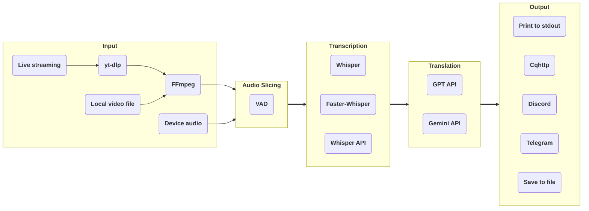

[](https://badge.fury.io/py/stream-translator-gpt)

# stream-translator-gpt

English | [简体中文](./README_CN.md)



Command line utility to transcribe or translate audio from livestreams in real time. Uses [yt-dlp](https://github.com/yt-dlp/yt-dlp) to 
get livestream URLs from various services and [Whisper](https://github.com/openai/whisper) / [Faster-Whisper](https://github.com/SYSTRAN/faster-whisper) for transcription.

This fork optimized the audio slicing logic based on [VAD](https://github.com/snakers4/silero-vad), 
introduced [GPT API](https://platform.openai.com/api-keys) / [Gemini API](https://aistudio.google.com/app/apikey) to support language translation beyond English, and supports input from the audio devices.

Try it on Colab: [](https://colab.research.google.com/github/ionic-bond/stream-translator-gpt/blob/main/stream_translator.ipynb)

## Prerequisites

**Linux or Windows:**

1. Python >= 3.8 (Recommend >= 3.10)
2. [**Install CUDA 11 on your system.**](https://developer.nvidia.com/cuda-11-8-0-download-archive) (Faster-Whisper is not compatible with CUDA 12 for now).
3. [**Install cuDNN to your CUDA dir**](https://developer.nvidia.com/cuda-downloads) if you want to use **Faseter-Whisper**.
4. [**Install PyTorch (with CUDA) to your Python.**](https://pytorch.org/get-started/locally/)
5. [**Create a Google API key**](https://aistudio.google.com/app/apikey) if you want to use **Gemini API** for translation. (Free 15 requests / minute)
6. [**Create a OpenAI API key**](https://platform.openai.com/api-keys) if you want to use **Whisper API** for transcription or **GPT API** for translation.

**If you are in Windows, you also need to:**

1. [**Install and add ffmpeg to your PATH.**](https://www.thewindowsclub.com/how-to-install-ffmpeg-on-windows-10#:~:text=Click%20New%20and%20type%20the,Click%20OK%20to%20apply%20changes.)
2. Install [**yt-dlp**](https://github.com/yt-dlp/yt-dlp) and add it to your PATH.

## Installation

**Install release version from PyPI (Recommend):**

```
pip install stream-translator-gpt -U
stream-translator-gpt
```

or

**Clone master version code from Github:**

```
git clone https://github.com/ionic-bond/stream-translator-gpt.git
pip install -r ./stream-translator-gpt/requirements.txt
python3 ./stream-translator-gpt/translator.py
```

## Usage

- Transcribe live streaming (default use **Whisper**):

    ```stream-translator-gpt {URL} --model large --language {input_language}```

- Transcribe by **Faster Whisper**:

    ```stream-translator-gpt {URL} --model large --language {input_language} --use_faster_whisper```

- Transcribe by **Whisper API**:

    ```stream-translator-gpt {URL} --language {input_language} --use_whisper_api --openai_api_key {your_openai_key}```

- Translate to other language by **Gemini**:

    ```stream-translator-gpt {URL} --model large --language ja --gpt_translation_prompt "Translate from Japanese to Chinese" --google_api_key {your_google_key}```

- Translate to other language by **GPT**:

    ```stream-translator-gpt {URL} --model large --language ja --gpt_translation_prompt "Translate from Japanese to Chinese" --openai_api_key {your_openai_key}```

- Using **Whisper API** and **Gemini** at the same time:

    ```stream-translator-gpt {URL} --model large --language ja --use_whisper_api --openai_api_key {your_openai_key} --gpt_translation_prompt "Translate from Japanese to Chinese" --google_api_key {your_google_key}```

- Local video/audio file as input:

    ```stream-translator-gpt /path/to/file --model large --language {input_language}```

- Computer microphone as input:

    ```stream-translator-gpt device --model large --language {input_language}```
    
    Will use the system's default audio device as input.

    If you want to use another audio input device, `stream-translator-gpt device --print_all_devices` get device index and then run the CLI with `--device_index {index}`.

    If you want to use the audio output of another program as input, you need to [**enable stereo mix**](https://www.howtogeek.com/39532/how-to-enable-stereo-mix-in-windows-7-to-record-audio/).

- Sending result to Cqhttp:

    ```stream-translator-gpt {URL} --model large --language {input_language} --cqhttp_url {your_cqhttp_url} --cqhttp_token {your_cqhttp_token}```

- Sending result to Discord:

    ```stream-translator-gpt {URL} --model large --language {input_language} --discord_webhook_url {your_discord_webhook_url}```

- Saving result to a .srt subtitle file:

    ```stream-translator-gpt {URL} --model large --language ja --gpt_translation_prompt "Translate from Japanese to Chinese" --google_api_key {your_google_key} --hide_transcribe_result --output_timestamps --output_file_path ./result.srt```

## All options

| Option                             | Default Value  | Description                                                                                                                                                                                              |
| :--------------------------------- | :------------- | :------------------------------------------------------------------------------------------------------------------------------------------------------------------------------------------------------- |
| **Input Options**                  |
| `URL`                              |                | The URL of the stream. If a local file path is filled in, it will be used as input. If fill in "device", the input will be obtained from your PC device.                                                 |
| `--format`                         | wa*            | Stream format code, this parameter will be passed directly to yt-dlp.                                                                                                                                    |
| `--cookies`                        |                | Used to open member-only stream, this parameter will be passed directly to yt-dlp.                                                                                                                       |
| `--device_index`                   |                | The index of the device that needs to be recorded. If not set, the system default recording device will be used.                                                                                         |
| **Audio Slicing Options**          |
| `--frame_duration`                 | 0.05           | The unit that processes live streaming data in seconds, should be >= 0.03                                                                                                                                |
| `--continuous_no_speech_threshold` | 0.5            | Slice if there is no speech for a continuous period in second.                                                                                                                                           |
| `--min_audio_length`               | 3.0            | Minimum slice audio length in seconds.                                                                                                                                                                   |
| `--max_audio_length`               | 30.0           | Maximum slice audio length in seconds.                                                                                                                                                                   |
| `--prefix_retention_length`        | 0.5            | The length of the retention prefix audio during slicing.                                                                                                                                                 |
| `--vad_threshold`                  | 0.35           | The threshold of Voice activity detection. if the speech probability of a frame is higher than this value, then this frame is speech.                                                                    |
| **Transcription Options**          |
| `--model`                          | small          | Select model size. See [here](https://github.com/openai/whisper#available-models-and-languages) for available models.                                                                                    |
| `--language`                       | auto           | Language spoken in the stream. See [here](https://github.com/openai/whisper#available-models-and-languages) for available languages.                                                                     |
| `--beam_size`                      | 5              | Number of beams in beam search. Set to 0 to use greedy algorithm instead (faster but less accurate).                                                                                                     |
| `--best_of`                        | 5              | Number of candidates when sampling with non-zero temperature.                                                                                                                                            |
| `--use_faster_whisper`             |                | Set this flag to use Faster Whisper implementation instead of the original OpenAI implementation                                                                                                         |
| `--use_whisper_api`                |                | Set this flag to use OpenAI Whisper API instead of the original local Whipser.                                                                                                                           |
| `--whisper_filters`                | emoji_filter   | Filters apply to whisper results, separated by ",".                                                                                                                                                      |
| **Translation Options**            |
| `--openai_api_key`                 |                | OpenAI API key if using GPT translation / Whisper API.                                                                                                                                                   |
| `--google_api_key`                 |                | Google API key if using Gemini translation.                                                                                                                                                              |
| `--gpt_model`                      | gpt-3.5-turbo  | OpenAI's GPT model name, gpt-3.5-turbo / gpt-4 / gpt-4o.                                                                                                                                                 |
| `--gemini_model`                   | gemini-1.0-pro | Google's Gemini model name, gemini-1.0-pro / gemini-1.5-flash-latest / gemini-1.5-pro-latest                                                                                                             |
| `--gpt_translation_prompt`         |                | If set, will translate the result text to target language via GPT / Gemini API (According to which API key is filled in). Example: "Translate from Japanese to Chinese"                                  |
| `--gpt_translation_history_size`   | 0              | The number of previous messages sent when calling the GPT / Gemini API. If the history size is 0, the translation will be run parallelly. If the history size > 0, the translation will be run serially. |
| `--gpt_translation_timeout`        | 10             | If the GPT / Gemini translation exceeds this number of seconds, the translation will be discarded.                                                                                                       |
| `--gpt_base_url`                   |                | Customize the API endpoint of GPT.                                                                                                                                                                       |
| `--retry_if_translation_fails`     |                | Retry when translation times out/fails. Used to generate subtitles offline.                                                                                                                              |
| **Output Options**                 |
| `--output_timestamps`              |                | Output the timestamp of the text when outputting the text.                                                                                                                                               |
| `--hide_transcribe_result`         |                | Hide the result of Whisper transcribe.                                                                                                                                                                   |
| `--output_file_path`               |                | If set, will save the result text to this path.                                                                                                                                                          |
| `--cqhttp_url`                     |                | If set, will send the result text to the cqhttp server.                                                                                                                                                  |
| `--cqhttp_token`                   |                | Token of cqhttp, if it is not set on the server side, it does not need to fill in.                                                                                                                       |
| `--discord_webhook_url`            |                | If set, will send the result text to the discord channel.                                                                                                                                                |
| `--telegram_token`                 |                | Token of Telegram bot.                                                                                                                                                                                   |
| `--telegram_chat_id`               |                | If set, will send the result text to this Telegram chat. Needs to be used with \"--telegram_token\".                                                                                                     |

## Contact me

Telegram: [@ionic_bond](https://t.me/ionic_bond)

## Donate

[PayPal Donate](https://www.paypal.com/donate/?hosted_button_id=D5DRBK9BL6DUA) or [PayPal](https://paypal.me/ionicbond3)
