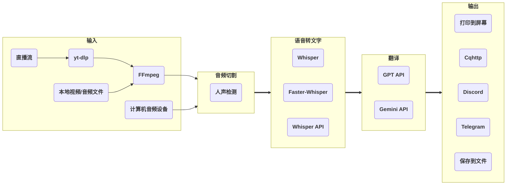

[](https://badge.fury.io/py/stream-translator-gpt)

# stream-translator-gpt

[English](./README.md)  | 简体中文



一个用于直播流音频实时转文字/翻译的命令行工具。使用[yt-dlp](https://github.com/yt-dlp/yt-dlp)从直播URL获取音频数据，并使用[Whisper](https://github.com/openai/whisper) / [Faster-Whisper](https://github.com/SYSTRAN/faster-whisper)进行语音转文字。

此Fork基于[人声检测](https://github.com/snakers4/silero-vad)优化了音频切片逻辑，引入了[GPT API](https://platform.openai.com/api-keys) / [Gemini API](https://aistudio.google.com/app/apikey)，以支持除英语之外的语言翻译，并支持从计算机的音频设备输入。

在Colab上试用：[](https://colab.research.google.com/github/ionic-bond/stream-translator-gpt/blob/main/stream_translator.ipynb)

## 准备工作

**Linux或Windows：**

1. Python >= 3.8 (推荐 >= 3.10)
2. [**在您的系统上安装CUDA。**](https://developer.nvidia.com/cuda-downloads)
3. 如果你想使用 **Faseter-Whisper**, 需要[**将cuDNN安装到你的CUDA目录中**](https://developer.nvidia.com/cudnn-downloads)。
4. [**将PyTorch（带有CUDA）安装到您的Python中。**](https://pytorch.org/get-started/locally/)
5. 如果你想用 **Gemini API** 进行翻译，需要[**创建一个Google API密钥**](https://aistudio.google.com/app/apikey)。（每分钟免费15次请求）
6. 如果你想用 **Whisper API** 进行转录或 **GPT API** 进行翻译，需要[**创建一个OpenAI API密钥**](https://platform.openai.com/api-keys)

**如果您是Windows用户，则还需：**

1. [**在PATH中添加并安装ffmpeg。**](https://www.thewindowsclub.com/how-to-install-ffmpeg-on-windows-10#:~:text=Click%20New%20and%20type%20the,Click%20OK%20to%20apply%20changes.)
2. 下载并添加[**yt-dlp**](https://github.com/yt-dlp/yt-dlp)至PATH环境变量。

## 安装

**从 PyPI 安装稳定版本（推荐）：**

```
pip install stream-translator-gpt -U
stream-translator-gpt
```

或者

**从 Github 拉取开发版本代码：**

```
git clone https://github.com/ionic-bond/stream-translator-gpt.git
pip install -r ./stream-translator-gpt/requirements.txt
python3 ./stream-translator-gpt/translator.py
```

## 使用方法

- 直播流语音转文字（默认使用 **Whisper**）：

    ```stream-translator-gpt {URL} --model large --language {input_language}```

- 通过 **Faster Whisper** 进行语音转文字：

    ```stream-translator-gpt {URL} --model large --language {input_language} --use_faster_whisper```

- 通过 **Whisper API** 进行语音转文字：

    ```stream-translator-gpt {URL} --language {input_language} --use_whisper_api --openai_api_key {your_openai_key}```

- 通过 **Gemini** 将内容翻译成其他语言：

    ```stream-translator-gpt {URL} --model large --language ja --gpt_translation_prompt "翻译以下日语为中文，只输出译文，不要输出原文" --google_api_key {your_google_key}```

- 通过 **GPT** 将内容翻译成其他语言：

    ```stream-translator-gpt {URL} --model large --language ja --gpt_translation_prompt "翻译以下日语为中文，只输出译文，不要输出原文" --openai_api_key {your_openai_key}```

- 同时使用 **Whisper API** 和 **Gemini** ：

    ```stream-translator-gpt {URL} --model large --language ja --use_whisper_api --openai_api_key {your_openai_key} --gpt_translation_prompt "Translate from Japanese to Chinese" --google_api_key {your_google_key}```

- 使用本地视频/音频文件作为输入源:

    ```stream-translator-gpt /path/to/file --model large --language {input_language}```

- 使用计算机麦克风作为输入源：

    ```stream-translator-gpt device --model large --language {input_language}```

    将使用系统默认的音频设备作为输入。

    如果你想使用其他音频输入设备，`stream-translator-gpt device --print_all_devices` 获取设备索引，然后运行 CLI 命令 `--device_index {index}`。

    如果你想使用另一个程序的音频输出作为输入，你需要[**启用立体声混音**](https://www.howtogeek.com/39532/how-to-enable-stereo-mix-in-windows-7-to-record-audio/)。

- 将结果发送到 Cqhttp：

    ```stream-translator-gpt {URL} --model large --language {input_language} --cqhttp_url {your_cqhttp_url} --cqhttp_token {your_cqhttp_token}```

- 将结果发送到 Discord：

    ```stream-translator-gpt {URL} --model large --language {input_language} --discord_webhook_url {your_discord_webhook_url}```

- 将结果保存到.srt字幕文件中:

    ```stream-translator-gpt {URL} --model large --language ja --gpt_translation_prompt "Translate from Japanese to Chinese" --google_api_key {your_google_key} --hide_transcribe_result --output_timestamps --output_file_path ./result.srt```

## 所有选项

| 选项                               | 默认值         | 描述                                                                                                                     |
| :--------------------------------- | :------------- | :----------------------------------------------------------------------------------------------------------------------- |
| **输入选项**                       |
| `URL`                              |                | 直播流的URL。如果填写了本地文件路径，它将被用作输入。如果填写"device"，输入将从您的PC音频设备获取。                      |
| `--format`                         | wa*            | 直播流格式代码，此参数将直接传递给yt-dlp。                                                                               |
| `--cookies`                        |                | 用于打开仅会员可看的直播流，此参数将直接传递给yt-dlp。                                                                   |
| `--device_index`                   |                | 音频输入设备的index。如果未设置，则使用系统默认音频输入设备。                                                            |
| **音频切割选项**                   |
| `--frame_duration`                 | 0.05           | 处理实时流数据的单位（以秒为单位），需大于等于0.03。                                                                     |
| `--continuous_no_speech_threshold` | 0.5            | 如果连续一段时间内没有语音，则进行切片（以秒为单位）。                                                                   |
| `--min_audio_length`               | 3.0            | 切片音频的最小长度（以秒为单位）。                                                                                       |
| `--max_audio_length`               | 30.0           | 切片音频的最大长度（以秒为单位）。                                                                                       |
| `--prefix_retention_length`        | 0.5            | 在切割过程中保留前缀音频的长度。                                                                                         |
| `--vad_threshold`                  | 0.35           | 人声检测阈值。如果一个帧的语音概率高于此值，那么这个帧就是人声。                                                         |
| **语音转文字选项**                 |
| `--model`                          | small          | Whisper模型大小。请在[此处](https://github.com/openai/whisper#available-models-and-languages)查看可用模型。              |
| `--language`                       | auto           | 直播流中的语言。请在[此处](https://github.com/openai/whisper#available-models-and-languages)查看可用语言。               |
| `--beam_size`                      | 5              | 波束搜索中的波束数量。设置为0以使用贪婪算法（更快但准确度较低）。                                                        |
| `--best_of`                        | 5              | 在非零温度下采样时的候选者数量。                                                                                         |
| `--use_faster_whisper`             |                | 设置此标志以使用Faster-Whisper实现，而不是原始的OpenAI实现                                                               |
| `--use_whisper_api`                |                | 设置此标志以使用OpenAI Whisper API，而不是原始本地Whipser.                                                               |
| `--whisper_filters`                | emoji_filter   | 应用于whisper结果的过滤器，由","分隔。                                                                                   |
| **翻译选项**                       |
| `--openai_api_key`                 |                | 如果使用GPT翻译/Whisper API，需要OpenAI API密钥。                                                                        |
| `--google_api_key`                 |                | 如果使用Gemini翻译，需要Google API密钥。                                                                                 |
| `--gpt_model`                      | gpt-3.5-turbo  | GPT模型名称，gpt-3.5-turbo / gpt-4 / gpt-4o                                                                              |
| `--gemini_model`                   | gemini-1.0-pro | Gemini模型名称，gemini-1.0-pro / gemini-1.5-flash-latest / gemini-1.5-pro-latest                                         |
| `--gpt_translation_prompt`         |                | 如果设置了该选项，将通过GPT / Gemini API（根据填写的API密钥决定）将结果文本翻译成目标语言。例如："从日语翻译成中文"      |
| `--gpt_translation_history_size`   | 0              | 调用GPT / Gemini API时发送的先前消息数量。如果历史记录大小为0，则会并行运行翻译。如果历史记录大小> 0，则会串行运行翻译。 |
| `--gpt_translation_timeout`        | 10             | 如果GPT / Gemini的翻译超过这个秒数，那么该次的翻译将被丢弃。                                                             |
| `--gpt_base_url`                   |                | 自定义GPT的API地址。                                                                                                     |
| `--retry_if_translation_fails`     |                | 当翻译超时/失败时重试。用于离线生成字幕。                                                                                |
| **输出选项**                       |
| `--output_timestamps`              |                | 输出文本时同时输出时间戳。                                                                                               |
| `--hide_transcribe_result`         |                | 隐藏语音转文字的结果。                                                                                                   |
| `--output_file_path`               |                | 如果设置，将会把结果文本保存到这个路径。                                                                                 |
| `--cqhttp_url`                     |                | 如果设置，将会把结果文本发送到cqhttp服务器。                                                                             |
| `--cqhttp_token`                   |                | cqhttp的令牌，如果在服务器端没有设置，不需要填写。                                                                       |
| `--discord_webhook_url`            |                | 如果设置，则会将结果文本发送到 discord 频道。                                                                            |
| `--telegram_token`                 |                | Telegram的令牌bot.                                                                                                       |
| `--telegram_chat_id`               |                | 如果设置，将把结果文本发送到此 Telegram Chat ID。需要与“--telegram_token”一起使用。                                      |

## 联系我

Telegram: [@ionic_bond](https://t.me/ionic_bond)

## 捐赠

[PayPal捐赠](https://www.paypal.com/donate/?hosted_button_id=D5DRBK9BL6DUA) 或 [PayPal](https://paypal.me/ionicbond3)
